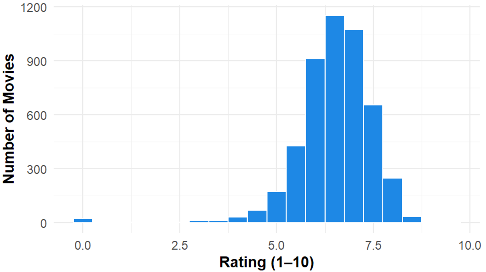
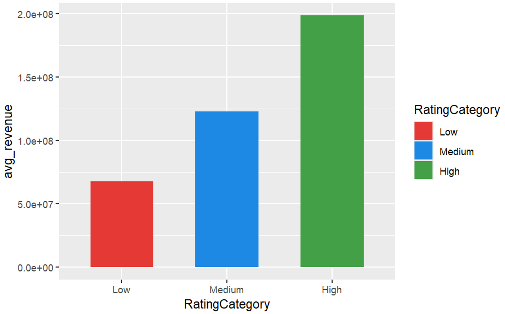
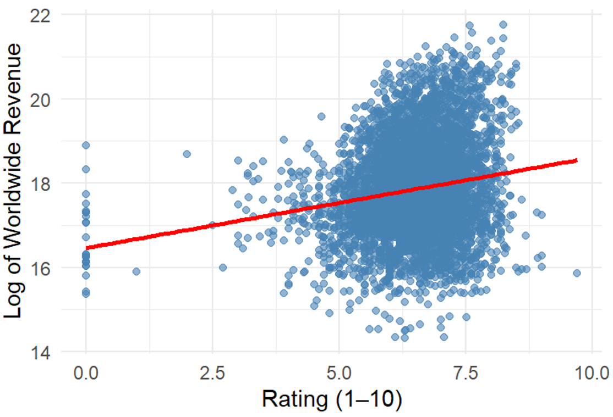

# Movie Box Office Analytics & Predictive Modeling

## Project Overview

This project investigates whether positive audience reviews influence movie success by analyzing the relationship between audience ratings and worldwide box office revenue.

Using box office data from 2000–2024, the study applies descriptive analytics, inferential statistics, and predictive modelling techniques to understand whether higher-rated movies generate significantly higher worldwide revenue.

The project follows a structured data analytics workflow, including data preprocessing, exploratory data analysis, statistical hypothesis testing, correlation analysis, and regression modelling using R.

This project was completed as an academic group project as part of the Data Science coursework.

---

# Research Question

**Do movies with higher audience ratings generate significantly higher worldwide box office revenue?**

This project evaluates the statement:

> "Positive Reviews Influence Audience Interest"

by statistically examining the relationship between audience ratings and box office performance.

---

# Dataset

**Source:** Kaggle Box Office Dataset (2000–2024)

The dataset contains movie-level information including:

- Movie title
- Release year
- Genre
- Audience rating
- Vote count
- Worldwide revenue
- Domestic revenue
- Foreign revenue
- Production country
- Language

### Data Preparation

The dataset was cleaned and prepared for analysis by:

- Removing missing and inconsistent records
- Converting revenue and rating attributes into numeric formats
- Removing duplicate entries
- Creating derived features:
  - Movie era (2000s, 2010s, 2020s)
  - Rating categories (Low, Medium, High)
  - Hit/Flop classification based on revenue thresholds

---

# Technologies Used

## Programming Language

- R

## Development Environment

- RStudio

## Libraries

- ggplot2
- dplyr
- dunn.test

## Statistical Techniques

- Exploratory Data Analysis (EDA)
- Shapiro-Wilk Normality Test
- Kruskal-Wallis Test
- Dunn's Post Hoc Test
- Spearman Correlation Analysis
- Linear Regression

---

# Project Workflow

## 1. Data Preprocessing

Prepared raw movie data for statistical analysis by cleaning records, handling missing values, converting variables, and creating new analytical features.

## 2. Exploratory Data Analysis

Explored movie rating patterns and revenue distributions using statistical summaries and visualizations.

Key analyses:

- Rating distribution analysis
- Revenue distribution analysis
- Revenue comparison across rating categories
- Relationship between ratings and revenue

## 3. Inferential Analysis

Applied statistical hypothesis testing to evaluate whether audience ratings are associated with differences in worldwide revenue.

Tests performed:

- Shapiro-Wilk Test
- Kruskal-Wallis Test
- Dunn's Post Hoc Test
- Spearman Correlation

## 4. Predictive Analysis

Developed a Simple Linear Regression model to evaluate how well audience ratings can predict worldwide revenue.

Model evaluation metrics:

- R²
- RMSE

---

# Hypothesis

## Null Hypothesis (H₀)

There is no statistically significant relationship between audience ratings and worldwide box office revenue.

## Alternative Hypothesis (H₁)

There is a statistically significant relationship between audience ratings and worldwide box office revenue, where higher-rated movies tend to achieve higher revenue.

---

# Key Findings

### Audience Ratings and Revenue Relationship

Movies with higher audience ratings generally showed higher worldwide revenue trends; however, the relationship was relatively weak.

### Statistical Testing Results

- Kruskal-Wallis and Dunn's Post Hoc tests identified statistically significant differences between rating groups.
- Higher-rated movie categories showed significantly different revenue distributions compared with lower-rated categories.

### Correlation Analysis

Spearman correlation showed:
- ρ = 0.1405
- p-value < 2.2 × 10⁻¹⁶

This indicates a statistically significant but weak positive relationship between ratings and worldwide revenue.

### Regression Model

Linear Regression results:
- R² = 0.034
- RMSE = 1.14

Audience ratings explain approximately **3.4% of worldwide revenue variation**, indicating that ratings alone are not sufficient for accurate revenue prediction.

---

# Visualizations

## Exploratory Data Analysis

### Distribution of Movie Ratings

### Average Revenue by Rating Category

### Rating vs Worldwide Revenue

### Revenue Density Analysis

---

# Project Structure

---

# Limitations

- Audience ratings alone cannot accurately predict box office revenue.
- The model does not include important factors such as:
  - Production budget
  - Marketing expenditure
  - Actor popularity
  - Director influence
  - Franchise popularity
  - Audience demographics

---

# Future Improvements

Future improvements could include:

- Adding additional predictive variables
- Using machine learning models such as:
  - Random Forest
  - Gradient Boosting
  - XGBoost
- Including inflation-adjusted revenue
- Incorporating audience engagement metrics
- Developing a more comprehensive revenue prediction system

---

# Conclusion

The analysis shows that audience ratings have a positive influence on worldwide box office performance, but ratings alone cannot explain or predict movie success accurately.

Box office performance depends on multiple factors including financial investment, marketing strategy, audience reach, and movie characteristics.

> Higher ratings improve success potential, but accurate prediction requires multiple factors rather than audience ratings alone.

---

# Author

**Ishoda Moderage**

BSc (Hons) Information Technology  
Specializing in Data Science  
Sri Lanka Institute of Information Technology (SLIIT)
